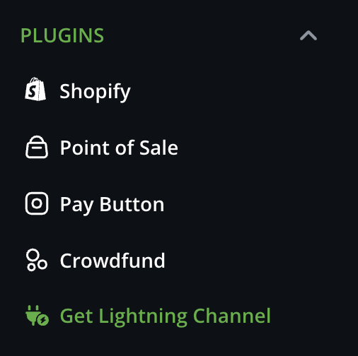
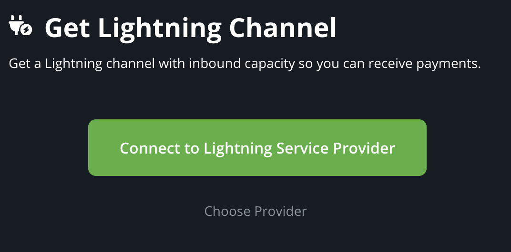
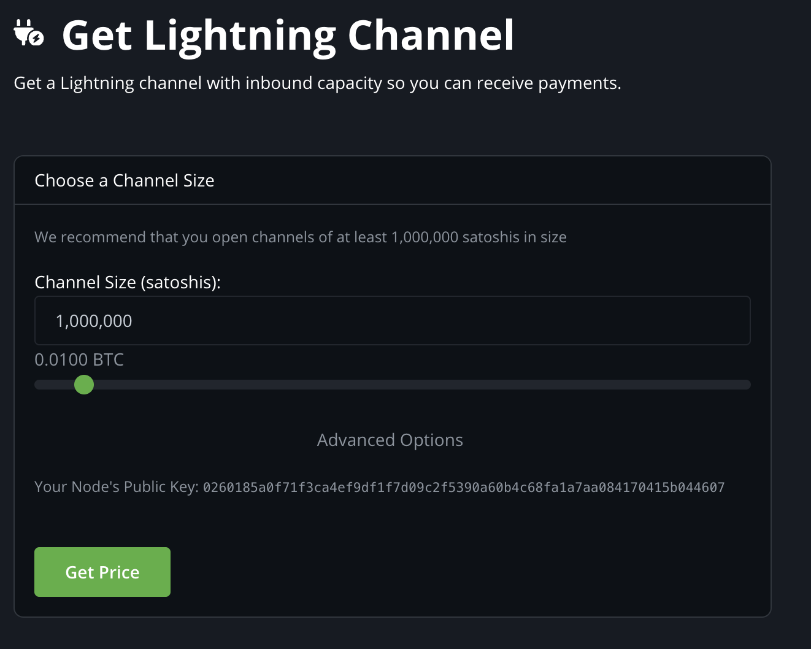
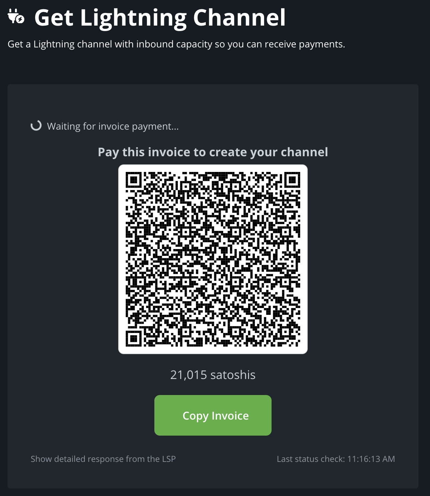

# LSPS1 BTCPay Server Plugin

The [LSPS1 (bLIP 51)](https://github.com/lightning/blips/blob/master/blip-0051.md) standard is a user-facing system for  nodes on the Lightning Network to get "inbound capacity", so that they can receive payments.  

This plugin is designed to implement the client-side behavior of LSPS1. It's optimizing maximum ease-of-use, and certain choices for the user to try to maximize compatibility across various node implementations.

Our goals is that a new or existing BTCPay user could get an inbound channel to an attached or embedded Lightning node in just a few seconds.

In this application, we have two parties:

THE CLIENT: This is the BTCPay user, running BTCPay on a local computer or VPS, along with an attached or embedded Lightning node. 

THE LSP: This is the service provider who runs an HTTP server which listens for LSPS1 client requests, generates invoices, and open channels. 

This plugin allows for THE CLIENT to choose among several LSPs who are offering LSPS1-compliant services. 

### Deviation from the LSPS1 Standard
 
LSPS1 calls for communication between THE CLIENT and THE LSP to be [carried over Lightning's BOLT8 transport layer](https://github.com/lightning/blips/blob/b48e5db6864d1de6e4b6d71a73ad75569cbff20c/blip-0051.md?plain=1#L14).

BOLT8 is more private than HTTPs, and has other advantages, however, there would be serious practical difficulties in implementing BOLT8 communication for BTCPay. 

A BTCPay Server plugin attempting to communicate **through** an attached or embedded Lightning node to an external service would be a very ambitious thing to attempt:  As we will see in this documentation, BTCPay Server's ability to query or manipulate its attached Lightning node is (currently) quite rudimentary.

Furthermore: BTCPay Server can be used with many **different** kinds of Lightning nodes, many of which don't yet have support for ad-hoc BOLT 8 messaging.  

So: For a plugin to attempt to communicate with an LSP like 
`Client --> BTCPay Server --> Lightning Node --> LSP`...

... this would be really, really, complicated, and would leave quite a few opportunities for hard-to-diagnose bugs and edge cases.  

Therefore, for this application, almost all communication between THE CLIENT and the THE LSP is carried over HTTPs. (**Almost** all, because, of course, the actual channel opening negotiation happens via the standard Lightning protocol.)

Besides this one caveat, this plugin is designed to comply fully with LSPS1.[^1]

## Design principles

BTCPay Server is a complex application with several layers of APIs added at various points during in its lifetime. 

It's also written in a language (C#) which only a small minority of developers have experience with. At the same time, security is extremely important. 

All this adds up (in our view) to a requirement for plugin developers: Only use server-side (C#, dotnet) functionality in your plugin where **absolutely necessary**. The fewer points of contact between your code and BTCPay server's API, the fewer points of failure (or security holes) you should have. 
 
For this reason, we've tried to push as much of the complexity as possible of this plugin to the client side, to everyone's favorite client-side language: Javascript.

We rely on C# methods in BTCPay Server for only two purposes:
1. We validate that THE CLIENT has a Lightning node attached to his/her BTCPay Server instance, and get the `public_key` of this Lightning node.
2. We ask BTCpay server's attached Lightning node to reach out and "connect" to the LSP's public URI. (This is NOT via http, this happens strictly over the Lightning network.)

The code to perform these operations is simple, and we invite you to review it in [LSPS1Controller.cs](BTCPayServer.Plugins.LSPS1/Controllers/LSPS1Controller.cs) and [LightningNodeService.cs](BTCPayServer.Plugins.LSPS1/Services/LightningNodeService.cs).

## User flow

### Using the plugin

THE CLIENT installs the plugin.

Following a nice cup of tea, or perhaps a well-earned bong hit, THE CLIENT, running BTCPayer server, uses the "Get Lightning Channel" link, which is displayed amongst the list of available plugins.

### Connect to LSP
At this point THE CLIENT gets to the first page of the plugin. If THE CLIENT has already attached a Lightning node to his BTCPay Server instance, he will see this screen:

If THE CLIENT has NOT yet attached a Lightning node to his BTCPay server instance, or if we are unable to determine the `public key` of THE CLIENT's attached Lightning node, then THE CLIENT will instead see a message here directing him to the `/lightning/BTC` route, in order to set up a Lightning Node.

You will note on this screen that we have a big green button bearing the label "Connect to Lightning Service Provider". This is for an important reason:  We don't want BTCPay server users who might just be randomly looking at menu options to actually connect to an LSP node: We want THE CLIENT to affirmatively click this button to show that they are really interested in going down this path.

This is because, although not addressed in the LSPS1 spec, there are potential denial-of-service issues with many thousands of nodes at once attempting to connect to the same LSP node. So it's better, in order to improve the reliability of LSPs, that clients don't just open new connections "for no reason."

On this screen, THE CLIENT can also choose which LSP he wants to acquire a channel from. 

### Choose a Channel Size

When THE CLIENT clicks "Connect to Lightning Service Provider" (the big green button), this triggers an HTTPs GET operation to the LSP's `get_info` endpoint. (Take a look at the logs in your browser console to see what is going back-and-forth to this endpoint.) Assuming THE LSP replies with a JSON object that is compliant with LSPS1, THE CLIENT then sees:

This screen is simple, but it embeds quite a few important assumptions that we should explain.

You will note that we tell THE CLIENT:

>We recommend that you open channels of at least 1,000,000 satoshis in size

A widely-held learned experience on the Lightning network is that opening channels that are "too small" results in disappointment, or worse. 

Small channels can only route limited payments until they are depleted.

But the biggest problem is that small channels can, during times of high fees, become uneconomical to close. And when dealing with interactions between different Lightning implementations (for example, a channel between a CLN node and an LND node), it's possible to get in a situation where one side of the channel will "refuse to close" a channel because doing so would be uneconomical. Then even worse things can happen, where, for example, one node disconnects from the other node and refuses to reconnect. 

For this reason, we:

1. Suggest (and provided a default at) a channel size of 1,000,000 satoshis.
2. Fully prevent THE CLIENT from requesting a channel size of below `150,000` satoshis, even if THE LSP in its `get_info` response allows channel sizes smaller than this. (Most don't go under 150k satoshis, but some do.)

If you use the slider, you will see that it doesn't go below `150,000` satoshis, and its upward bound matches the largest channel size that THE LSP supports (as communicated in the `get info` response.)

You will also note on this screen that, although such an option is available in the LSPS1 specification, we DO NOT provide the option for THE CLIENT to request a [zero-confirmation](https://bitcoinops.org/en/topics/zero-conf-channels/) channel. This is because all of the node implementations (LND, CLN, LDK-NODE, etc.) require that THE CLIENT proactively "allow" such channels, and that can be tricky.[^2]

#### Advanced Options

By default, THE CLIENT will request a PUBLIC channel from the LSP. By clicking `Advanced Options`, THE CLIENT may toggle between a PUBLIC and PRIVATE channel. If THE CLIENT selects a PRIVATE channel, we warn him that he will need to enable "hop hints" when creating invoices with BTCPay.

#### Node public key

Some BTCPay users may be unsure of how to get their node's public key, so we provide it in the interface. 

#### Get Price button

A common question about LSPS1 implementations is "Why can't I see all the prices from all the LSPs at the same time?" And, you see here that we require THE CLIENT to pick a channel size BEFORE THE LSP provides a price quote. The short answer is that generating an invoice is a somewhat "expensive" operation for LSPs, and LSPS1 requires that all "price quotes" are [accompanied by fully valid invoices](https://github.com/lightning/blips/blob/master/blip-0051.md#2-lsps1create_order). Indeed, well-run LSPs will actually have rate-limiting in place to prevent a user from requesting too many invoices, too fast. 

### Pay invoice to trigger channel opening

After clicking "Get Price", THE CLIENT sees this screen:

Here the THE CLIENT may pay the invoice with any Lightning wallet. THE CLIENT's browser then begins to poll the [get order](https://github.com/lightning/blips/blob/master/blip-0051.md#21-lsps1get_order) endpoint. 

Note that in LSPS1, all payments are made via [hold invoices](https://bitcoinops.org/en/topics/hold-invoices/), which is an older, quite stable, and very useful invoice flavor.

A very nice quality of using "hold invoices" is that THE LSP can first ensure that it is able to open a channel to THE CLIENT, and then, only after the channel is in the process of opening,  "settle" the invoice (i.e. accept payment.)

Put another way: If an LSP is following LSPS1, it will be impossible for the LSP to receive payment and then fail to open a channel.

And also: For this reason, LSPs should NEVER need to "refund" THE CLIENT if the channel fails to open successfully.

### Success or Failure

At this point, our CLIENT is hopefully in the process of paying the invoice.

Simultaneously, THE CLIENT is polling THE LSP's [get order](https://github.com/lightning/blips/blob/master/blip-0051.md#21-lsps1get_order)  endpoint, and, when that endpoint sends back something useful, THE CLIENT displays an appropriate failure or success message.

## Testing this plugin  

Typically, entites who are developing BTCPay server plugins are encouraged to use a Docker setup, with all the major ancillary services (NBXplorer, Bitcoind, Lightning Node) [running in regtest](https://docs.btcpayserver.org/Development/LocalDev/#dependencies).

In theory, this is a great idea, but, after some confusion about the issue, we realized that there would be no practical way to use or test THIS plugin on regtest.

This plugin is wholly reliant on external services provided by THE LSP, accessible over HTTPs.  Theoretically you could replicate THE LSP locally, but then you would have to run your own server-side LSP service, and that would be very, very complicated, and leave little remaining time for smoking joints and going on bike rides, or similar.  

Therefore, unless anyone else has a bright idea, our best suggestion is to test this plugin with a Docker Compose file like [the one we use](https://github.com/MegalithicBTC/btcpayserver-docker/blob/master/docker-compose-ubuntu-caddy.yml) -- this shows the major services all running on Mainnet.

It would also be possible to modify the plugin to allow THE CLIENT to choose between MutinyNet/Signet and Mainnet, as several of the LSPs have duplicate instances running on [MutinyNet/Signet](https://docs.megalithic.me/lightning-services/lsp1-get-inbound-liquidity-for-mobile-clients#step-1-client-requests-info-about-the-lsp-service), but we haven't implemented that. If you need to test this on Mutiny/Signet, let us know, as it should be straightforward to implement. (At least straightforward when compared to other terrifying C# codebases, that is.)

## Issues for future investigation

### Client-side channel data

The LSPS1 specification does not require that the THE CLIENT have any particular access to data about its own node: The entire LSPS1 flow can be accomplished without THE CLIENT looking at its own internal state or list of channels. If this paragraph makes no sense to you: We're just saying that LSPS1 was carefully crafted to be fairly lightweight for the client.

It would however **be kind of useful** for THE CLIENT to have access to data about his own node, because then, BTCPay server could show useful alerts like:

> ⚠️ **No Inbound Capacity**  
> You have a Lightning Node, but no channel with inbound capacity. Please get a channel from an LSP so you can receive Lightning payments.

...and/or...

> ⚠️ **Channels Depleted**  
> Your Lightning Channels are depleted and you can no longer receive payments. Please swap funds out of your channel(s) or get a new channel from an LSP.

This is behavior we wanted to include with this plugin, and indeed, we saw some [sample work by LQWD](https://github.com/lightningriders/BTCPayServerPluginsProd/blob/3517fa40ce48767bb6c285273be9fef66090c8fb/Plugins/BTCPayServer.Plugins.Lqwd/Services/LqwdPluginService.cs#L335) which led to to initially believe that we WOULD be able to get such data through BTCPay server's API. 

Further investigation however has let us to believe that there is currently [no reliable way](https://github.com/Kukks/BTCPayServerPlugins/blob/6761a8f385aab596235975e46dd78e62724c74ea/Plugins/BTCPayServer.Plugins.MicroNode/MicroLightningClient.cs#L262) to get a list of channels from BTCPay server's API. 

But, daring to dream: Client-side channel data could also help users answer what will likely be a common question: "I paid the invoice to get the channel, I think I got the channel, but where can I see it?"

Currently THE CLIENT has to know, that, if we wants to see his freshly opened channel, he needs to open a separate interface, for example "Ride The Lightning", in order to see the channel that was opened following the successful usage of this plugin.

### Client-side persistence

LSPS1 does NOT require that THE CLIENT perform any kind of long-term persistence of data in order to acquire a channel. It was therefore with some puzzlement that we reviewed [LQWD's plugin](https://github.com/lightningriders/BTCPayServerPluginsProd/tree/3517fa40ce48767bb6c285273be9fef66090c8fb/Plugins/BTCPayServer.Plugins.Lqwd/Migrations), which includes extensive database migrations. 

In general, we think it's better to not attempt to persist state to BTCPay Server's database. But a counter-argument could be made: It might be useful for THE CLIENT to be able to see a "list of channels acquired from LSPs", with historical data like the size of the channel. 

That said, this seems lower priority than [Client-side channel data](#client-side-channel-data), which would serve a similar purpose but also most critically provide the actual **balances** available in existing channels.

### Footnotes

[^1]: Well... compliant, but we don't implement all features.  For one thing: We totally don't allow THE CLIENT to pay for his/her channel with an on-chain payment. If you care, ask us and we can explain why. There are both security and UX issues with onchain payments which make Lightning payments for channel openings a lot better.

[^2]: Accepting zero-confirmation channels has security implications for the RECEIVER of the channel.  For this reason, all of the node implementations require special settings to allow inbound zero-confirmation channels.

For example: an LND node must have a special configuration value set to receive zero-conf channels, and it must additionally have a subscription CONSTANTLY RUNNING against the node called a [channel acceptor](https://lightning.engineering/api-docs/api/lnd/lightning/channel-acceptor/), which basically intercepts inbound channel requests and returns "yes" or "no" if the inbound channel requests should be "allowed" to be zero-conf. This script has the unpleasant property that, if the backing LND node has a hiccup of some kind, the subscription will just quietly die without much notice ... and an LND node in "channel acceptor" mode will actually refuse ALL inbound channel requests if it sees that an "acceptor" subscription is NOT running. This can be not-so-fun.

For CLN, users have the opportunity [to do battle](https://github.com/voltagecloud/zero-conf-cln) with various third-party plugins which might (or might not) allow them to successful open a zero-confirmation channel.

For LDK, zero-conf channels are much easier, but 95% of BTCPay users are likely using LND or CLN.  

